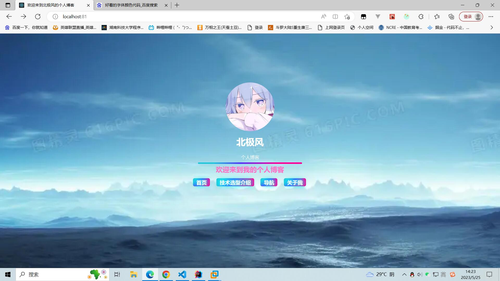
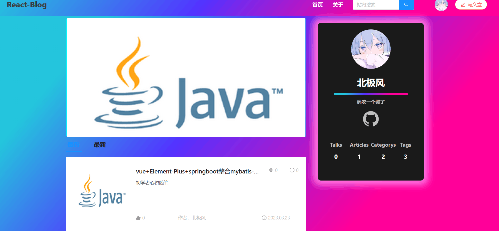
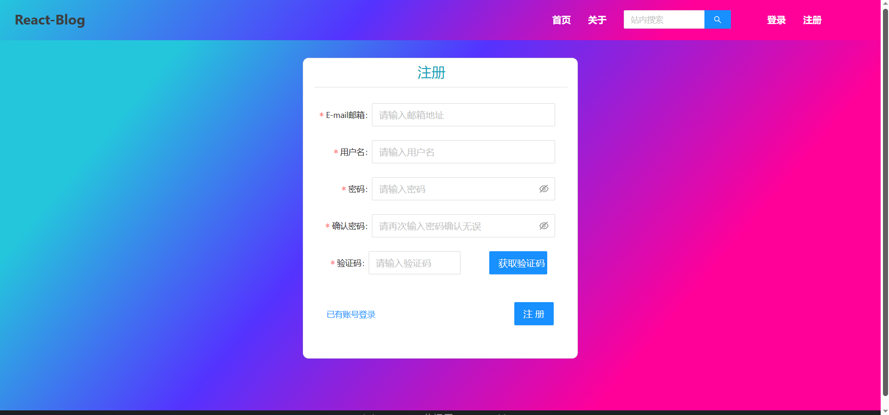
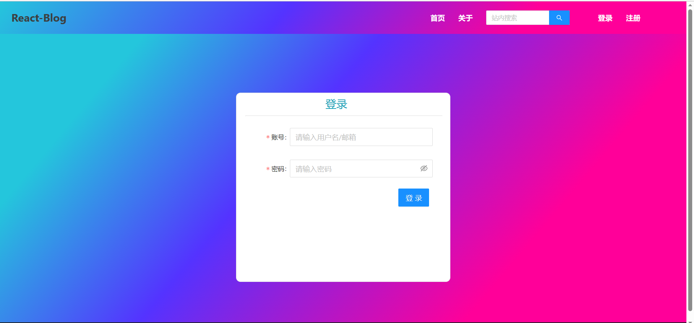
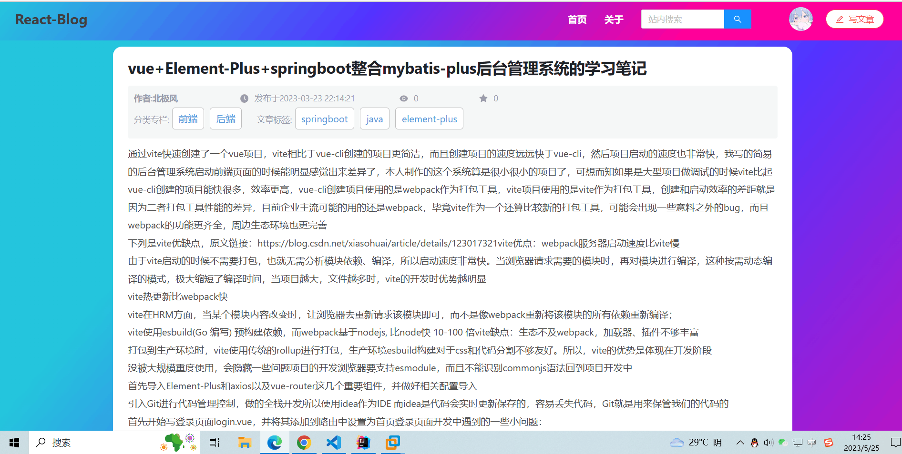
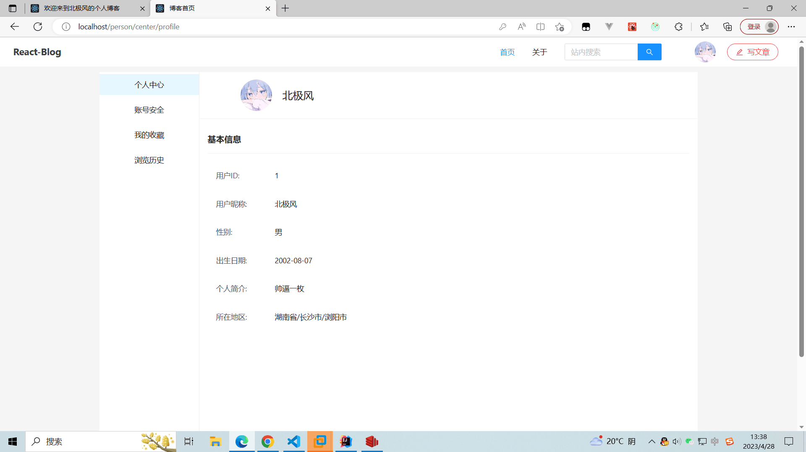
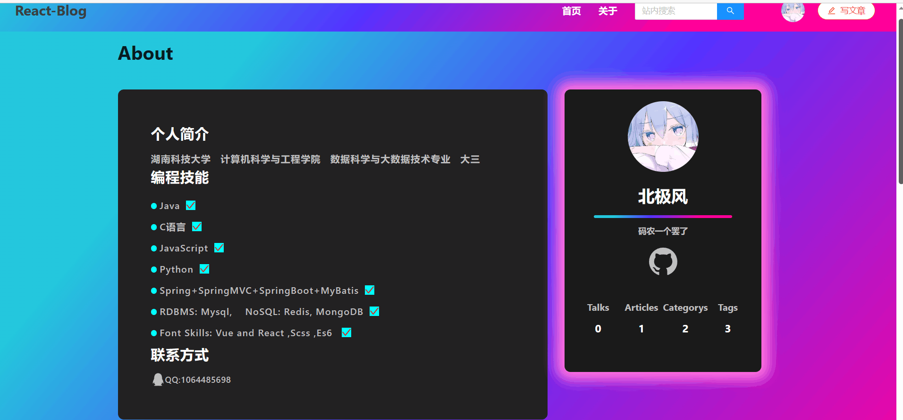
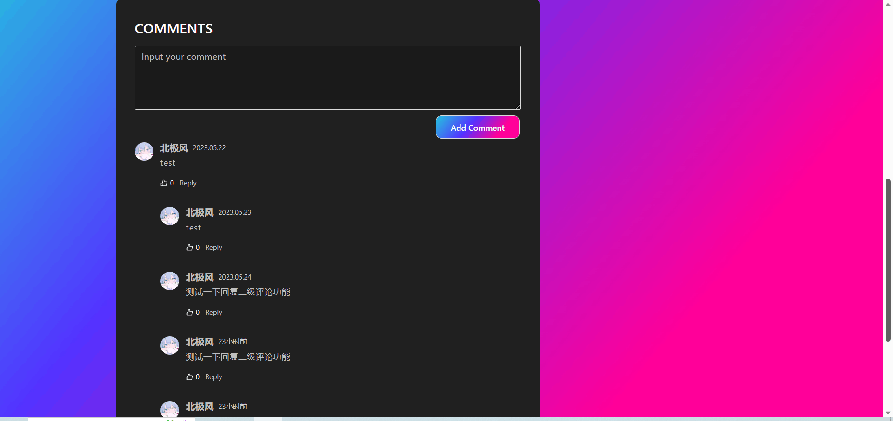

# 欢迎使用北极风的个人博客系统
>  项目预览链接：[北极风的个人网站](https://arctic-zsg.fun)

**ps:由于白嫖的阿里云的服务器内存不够，elasticsearch线上服务只能选择关闭以维持项目其他功能能正常运行，故将导致搜索功能线上无法使用，有需要研究的可以将项目拉到本地自己装好环境运行**

## 技术选型汇总

### 1.后端技术

|                  技术                  |                             说明                             |   版本号    |
| :------------------------------------: | :----------------------------------------------------------: | :---------: |
|               springboot               |      Java的web开发框架，通过注解的形式简化了繁琐的配置       |   2.6.11    |
|             spring-securiy             |       一个功能强大且高度可定制的身份验证和访问控制框架       |   2.6.11    |
|                 lombok                 | 通过注解的形式自动生成构造器、getter/setter、equals、toString等方法，简化开发 |   1.18.24   |
|              mybatis-plus              | mybatis的增强版，内置了分页插件，同时编译期生成了一些简单的单表操作方法 |    3.4.2    |
|                 druid                  | 阿里巴巴开源的数据库连接池项目，功能强大，性能优秀，是Java语言最好的数据库连接池之一 |   1.1.23    |
|                  jjwt                  | 用于生成jwt保存用户登录状态，前端每次将其放在请求头里供后端校验 |    0.9.0    |
|             commons-pool2              | springboot使用lettuce作为Redis客户端开启连接池需要依赖commons-pool2 |   2.11.1    |
|               Mapstruct                | Java对象映射转换框架，编译期生成两个对象转换的方法，底层是调用setter/getter，性能非常好 | 1.5.3 Final |
|                aspectj                 | 提供了一套完整的面向切面编程的框架，编译期织入，比SpringAOP性能要强非常多 |    1.9.5    |
|                Jackson                 |    springboot内置的序列化包，安全性好(fastjson bug比较多)    |  绑定boot   |
|       spring-boot-starter-quartz       |                         定时任务框架                         |   2.6.11    |
|        spring-boot-starter-mail        |                         发送邮件框架                         |   2.6.11    |
| spring-boot-starter-data-elasticsearch |        elasticsearch的Java Clinet的springboot整合版本        |   2.6.11    |

### 2.前端技术

|       技术       |                          说明                          | 版本号 |
| :--------------: | :----------------------------------------------------: | :----: |
|      React       |            用于构建用户界面的 JavaScript 库            | 18.2.0 |
| Ant-design-react |      React的UI组件库，提供了一系列开箱即用的组件       | 4.24.2 |
|      Swiper      |                       轮播图组件                       | 8.4.5  |
|       Sass       |   世界上最成熟、最稳定、最强大的专业级CSS扩展语言！    | 7.0.3  |
|  china-division  | 提供了中国各行政区域的名称的json文件，供地址选择器使用 | 2.6.1  |
|      axios       |                     js的http请求库                     | 1.1.3  |
|   braft-editor   |                   文章的富文本编辑器                   | 2.3.9  |
|   React-Redux    |                  react的状态管理框架                   | 8.0.5  |

##  环境搭建：

### 1.运行环境

|   应用名称    |  版本  |                           下载地址                           |
| :-----------: | :----: | :----------------------------------------------------------: |
|     Redis     | 6.2.7  |    [https://redis.io/download](https://redis.io/download)    |
|    MongoDB    | 4.4.17 | [https://www.mongodb.com/download-center](https://www.mongodb.com/download-center) |
|     Mysql     | 8.0.28 |       [https://www.mysql.com/](https://www.mysql.com/)       |
|      JDK      |  1.8   | [https://www.oracle.com/technetwork/java/javase/downloads/jdk8-downloads-2133151.html](https://www.oracle.com/technetwork/java/javase/downloads/jdk8-downloads-2133151.html) |
| Elasticsearch | 7.12.1 |   [https://www.elastic.co/cn/](https://www.elastic.co/cn/)   |

## 本地运行这个项目
### 1.拉取项目到本地 
`git clone https://github.com/zsg4399/Arctic-Blog.git`

### 2.修改application.yml
* 将druid配置下的 `username`和 `password`配置项修改成自己的，并且确认自己的MySQL版本高于5
* 将Redis部分相关的配置根据注释进行修改
`mail:
host: smtp.qq.com  #设置邮箱类型 
username: yourEmail       #邮箱地址 
password: yourSmtpToken   #授权码 
default-encoding: UTF-8`
* MongoDB自行安装好后修改application.yml中的配置
### 3.修改图片上传功能
在`imagecontroller`下的`getUploadToken`接口是返还smms的api token，前端拿到这个token后就能直接进行图片上传功能，如果需要使用这个功能，只需要注册smms后拿到自己账号的api token，然后将ImageController下的Access_Token常量修改为你的api token即可
### 4.数据库建表搭建
请执行sql文件夹下的blog.sql文件
### 5.开始运行项目
当你完成上述步骤，并且配置了项目所需要的 `Redis`、`Mysql`等环境后，进入启动类执行run方法即可启动项目

## 项目功能介绍
* 支持用户登录和注册功能模块，注册需要邮箱号。
* 基于jwt+springsecurity自定义实现的几个过滤器完成登录、鉴权的功能，登录后用户可以七天内免登录
* 支持用户发布文章，收藏点赞功能
* 支持用户个人中心，用户可以修改自己的基本信息以及账号安全管理
* 支持用户评论文章和关于页面
* 支持用户进行文章信息搜索

## 项目效果展示图
* ### 欢迎页界面：

* ### 首页效果界面图：

* ### 注册效果界面图：

请确保输入的邮箱账号存在，否则你将无法收到验证码完成注册
* ### 登录效果界面图

* ### 查看文章详情内容

* ### 查看个人信息

* ### About页面

* ### Comment组件(每篇文章和about页都引入了评论功能)
